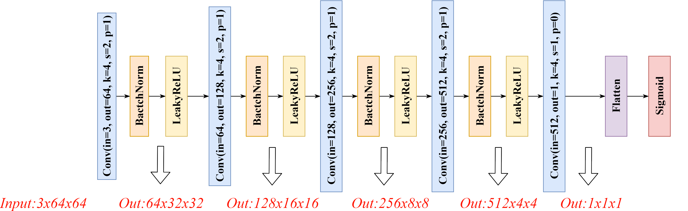
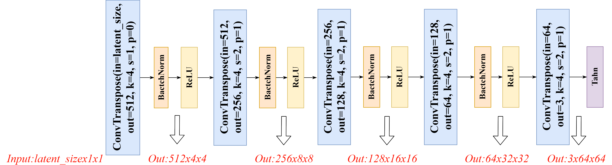
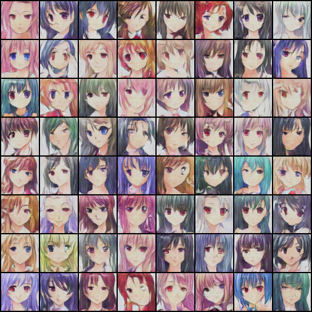

# Face Generation Using Generative Adversarial Networks (GANs)
Generative Adversarial Networks (GANs) are a powerful tool for generating realistic images, and they have been used in a variety of applications such as image synthesis, style transfer, and super-resolution. In this report, we utilize a method for generating anime faces using GANs. We found that the model was able to generate images that were similar to real anime faces, with a high degree of realism and similarity.

## Background
GANs were introduced by Ian Goodfellow et al in 2014. They consist of two neural networks: a generator and a discriminator. The generator creates new data, and the discriminator attempts to distinguish between the generated data and the real data. The generator and discriminator are trained in an adversarial manner, with the generator trying to create data that is indistinguishable from real data, and the discriminator trying to correctly identify which data is real and which is generated

## Method
### Dataset
In order to generate anime faces using GANs, we first used a dataset of Anime Face Dataset. It includes 36,740 anime face images, with each image being of size 64x64 pixels in 3-channel RGB format.

The following images show the system architecture of the network.

### Model Architecture and Hyperparameters
The GAN architecture used in this project was the popular DCGAN (Deep Convolutional Generative Adversarial Network) model. The generator network consisted of several transposed convolutional layers, while the discriminator network consisted of several convolutional layers. Figure 1 depicts the architecture of generator and dis- criminator networks. Both networks were trained using the Adam optimizer with a learning rate of 0.0002 and a batch size of 64. Ac- cording to instructions, all network weights are randomly assigned using a normal distribution with a mean of 0 and a standard deviation of 0.02. Other hyperparameters consist of Latent Factor Size = 512, Beta1 = 0.5, and Beta2 = 0.999.

### Results
The GAN was able to generate anime faces that were similar to the faces in the training dataset. The generated faces had distinctive anime features such as large eyes and round faces. However, some of the generated faces had distorted or unrealistic features, indicating that the model could benefit from further training or a larger dataset. The models were trained using the Google Colab platform, which offered free access to several GPUs. It should be noted that this access was limited in nature which in turn affected the quality of the experiments run. The project’s experiments included the DCGAN approach ran for 40 epochs (DCGAN). Figure 2 shows the training losses for each DCGAN network. Figure 3 also displays a few sample DCGAN-generated images.

Here you can see the result generated by DCGAN in the latest epoch 

# How to run
Just go to the `final` directory from the root path. You will see the Jupyter Notebook file. I have run it on [Google Colab](https://colab.google/), you can use this as well.